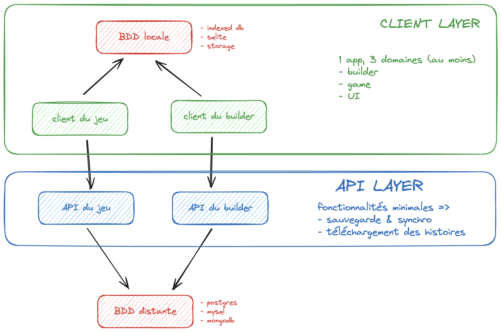

# Dev guide

## Git workflow

The usual workflow should look like this:

1. Choosing an issue in the `ready` column in Github Project.
2. Creating a branch for this issue. You can do this either by checking out locally or by using the built-in *create a branch* button in Github Project.
3. Resolving the issue locally.
4. Creating a Pull Request (PR) via the Github interface and assigning your peers to review your work.
5. Once the PR is validated by at least one other dev, merging the branch into the main branch.

## Local development

### Requirements

You need on your system:

* Bun
* Docker
* Python 3

### Client

Typescript execution & package management is handled by **bun**.

In the `client` folder

#### Install the dependencies

```bash
bun install
```

#### Run the client

```bash
bun run dev
```

### Server

In the `server` folder

#### Activate virtual env

```bash
python3 -m venv venv
```


```bash
source venv/bin/activate
```

#### Install the modules

```bash
pip3 install -r requirements.txt
```

#### Run the API

```bash
fastapi dev src/main.py
```

### Database

The remote database is mongodb. It is dockerized so you don't have to install locally.

```bash
docker compose up -d
```

## Project architecture


