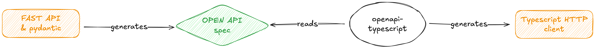
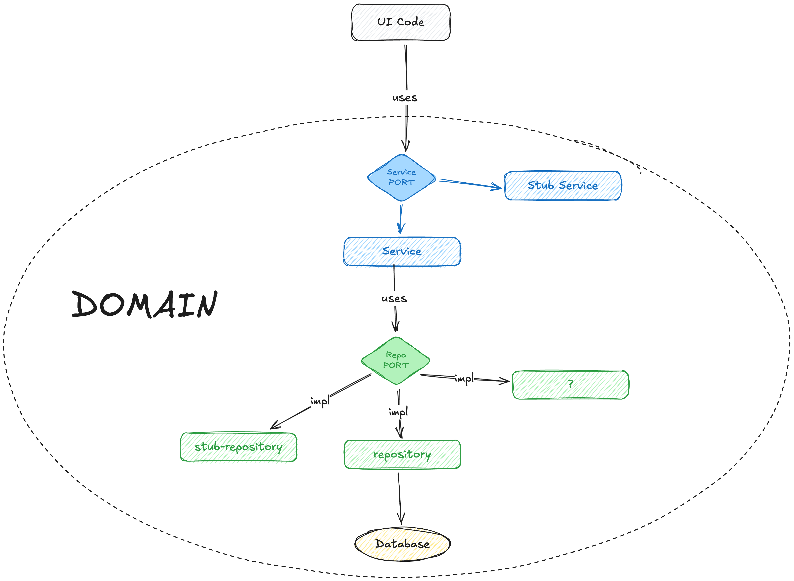
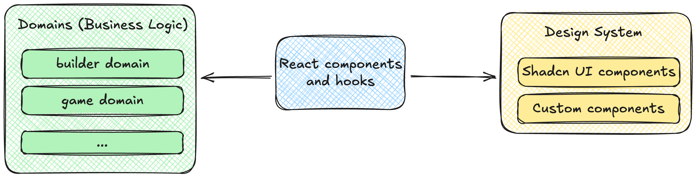

# Story Builder

Story Builder is an open-source platform for creating and playing choose your own adventure games. It's entirely free forever, and doesn't include ads.

The app is made of two sections :
* The **Builder** is a no-code visual editor where you can create your stories and export them
* The **Library** is where you can import stories and play them, track your game analytics and save your progress

We aim to explore the possibilities of digital stories - in Story Builder you can for example:
* Create conditional choices based on previous choices
* Create Wikis for your stories' lore and link them dynamically to the content of your stories
* Set-up character attributes, implement level-up mechanisms and condition choices based on attributes value
* Create random-based events in your stories, with customizable percentages
...and more to come

# Dev guide

## Local development

### Requirements

You need on your system:

- Bun
- Python 3.13
- pre-commit
- uv

#### Pre-commit

```sh
pip install pre-commit
```

and then

```sh
pre-commit install --hook-type pre-commit --hook-type pre-push
```

### Client

Typescript execution & package management is handled by **bun**.

In the `client` folder

#### Install the dependencies

```bash
bun install
```

#### Run the client

```bash
bun run dev
```

### Server

Dependencies and python versions are managed via `uv`
In the `server` folder

#### Run the API

```bash
uv run fastapi dev
```

or you can use the built-in VSCode debugger

### Run the linter

```bash
uv run ruff check
```

### Run the type checker

```bash
uv run mypy .
```

or in watch mode

```bash
cd server
./mypy-watch.sh
```

### Adding routes to the API

When you add endpoints to the API, make sure to use pydantic models for the request AND for the response. They are used for validation, but also for documentation (open-api and swagger generation). More importantly, remember to generate the client code by running:

```sh
cd client && bun run generate-client
```



### Database

The remote database is mongodb. It is dockerized so you don't have to install anything locally.

```bash
docker compose up -d database
```

## Project architecture

The overall architecture of Story Builder takes inspiration from Domain Driven Design (DDD) and Hexagonal Architecture (see [the article](https://alistair.cockburn.us/hexagonal-architecture/) that originated the concept). The broad concept is to split the application in domains (currently, there are 5: Builder, Game, Synchronization, Wiki and User), which are organized in ports (interfaces) and adapters : repositories which handle data persistence and services that handle business logic.



### Client architecture

Front-end should try to respect this pattern to avoid mixing business logic, rendering logic and glue code.


