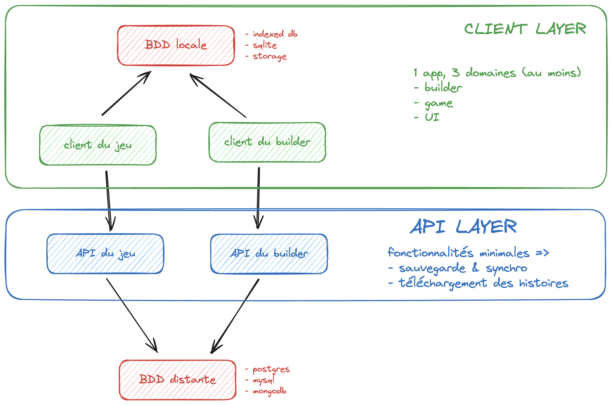

# How to use Server

## Path to do All

- login

1. Choosing an issue in the `ready` column in Github Project.
2. Creating a branch for this issue. You can do this either by checking out locally or by using the built-in _create a branch_ button in Github Project.
3. Resolving the issue locally.
4. Creating a Pull Request (PR) via the Github interface and assigning your peers to review your work.
5. Once the PR is validated by at least one other dev, merging the branch into the main branch.

## Local development

### Requirements

You need on your system:

- Bun
- Docker
- Python 3

### Client

Typescript execution & package management is handled by **bun**.

In the `client` folder

#### Install the dependencies

```bash
bun install
```txt
/api/login
```

- register

```txt
/api/register
```

## Path to do builder

- Save your game data

```txt
/api/builder/save/game
```

- Load your game data

```txt
/api/builder/load/game
```

## Path to do player

- Save your game data

```txt
/api/player/save/game
```

- Load your game data

```txt
/api/player/load/game
```

## Project architecture


